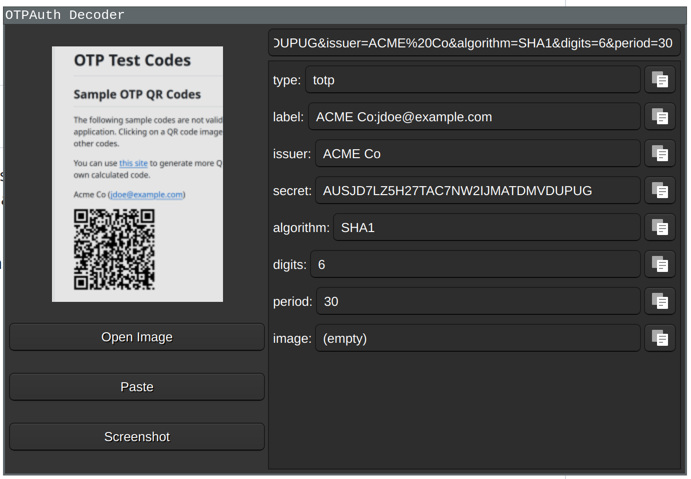

# qotpdecode

This project is a Qt-based application named `qotpdecode`. It is used for decoding OTP (One-Time Password) images using the zxing library.



## Build Instructions

### Dependencies

* [Qt5 or Qt6](https://www.qt.io/download)
* [zxing-cpp](https://github.com/zxing-cpp/zxing-cpp)
* *optional:* [scrot](https://github.com/resurrecting-open-source-projects/scrot) or [maim](https://github.com/naelstrof/maim) for screenshots with xorg
* *optional:* xdg desktop portal for screenshots in wayland
* *optional:* Qt Multimedia for camera support

| Distribution | Command                                 |
|--------------|-----------------------------------------|
| Debian/Ubuntu| `sudo apt-get install qt5-default libzxing-dev` |
| Arch Linux   | `sudo pacman -Syu qt6-base zxing-cpp`           |
| Fedora       | `sudo dnf install qt5-devel zxing-devel`         |
| openSUSE     | `sudo zypper install libQt5Widgets5-devel zxing-devel` |

### Build Steps

1. Clone the repository:
   
   ```
   git clone <repository_url>
   cd <repository_directory>
   ```

2. Build the project:
   
   ```
   qmake
   make
   ```

For building with camera support, qt multimedia is required. On my machine, only the qt6 version was able to capture the camera.

```
qmake6 CONFIG+=CAMERA
make
```

## Usage

Run `qotpdecode`.  
Images are accepted via Drag & Drop, Copy & Paste or opening with the file dialog.  
It is also possible to directly paste an `otpauth://` url and decode it.

Experimental Screenshot support is available.

Experimental support for camera capture is available via compile time switch.

## Limitations

Google Authenticator shows a qr code that uses a custom otpauth-migration protocol and only the pure text will be shown. 
[Use another decoder to extract the values.](https://github.com/topics/otpauth-migration)

## License

Licensed under the Apache License, Version 2.0.

Third party libraries:

* ZXingQt: Licensed under the Apache License, Version 2.0
